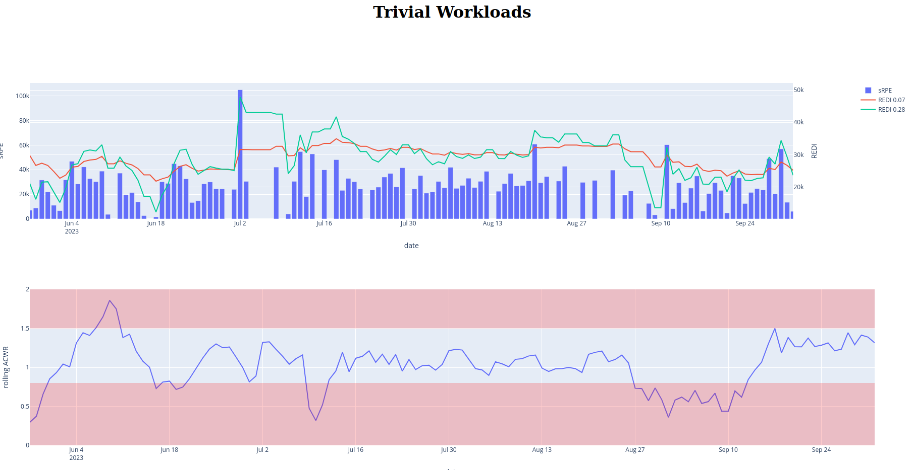

# FSTracker 

The FSTracker collects and processes data from strava and other platforms for the amateur runner.
It offers training load tracking such as acute/chronic ratio, REDI and other state of the art methods.

# Getting Started

## Strava API
In order to get started, the first step is to set up your strava API access. There are many different tutorials like this 
[one](https://jessicasalbert.medium.com/holding-your-hand-through-stravas-api-e642d15695f2). 

## This repo
The next step is to clone this repo. It is still a work in progress and it is susceptible to change in time.

# Usage 

Once you've set up the Strava API with the correct reading rights you should create a file `strava_api/config_strava.json`:
```json
{
  "client_id": "[YOUR_CLIENT_ID]",
  "client_secret": "[YOUR_CLIENT_SECRET]",
  "refresh_token": "[YOUR_REFRESH_TOKEN]"
}
```
Note that the token `"[YOUR_REFRESH_TOKEN]"`  is the token with the `activity:read_all`permissions form the tutorial.

So far, the pipeline from data acquisition to front is not formalized. It is necessary to run the files `strava_api/strava_reader.py`, then `training_loads/simple_loads.py` 
and then finally `front/landing_front.py`.




# Next development
 1. Training load evaluation based on Strava data -> So far, ACWR and Redi have been implemented
 2. Data viz app using dash
 3. Incorporate Polar/Garmin etc...
